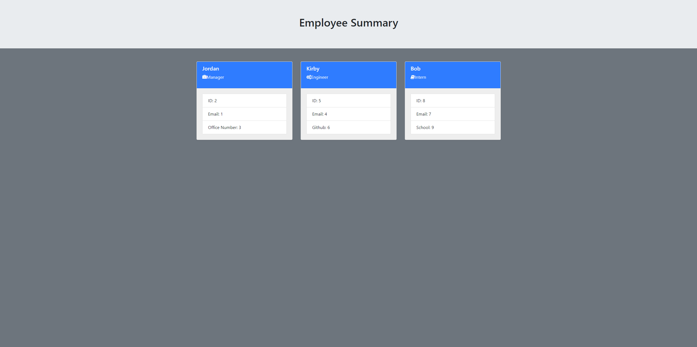

# Team-Profile-Generator

## Description 
Use this to make a fast and easy team generator, so that others can find and get in contact with them. Just by using a simple command line in your terminal. Just follow the installation and usage guide. Create a manager, engineer, and intern card for your contributors.

### Example gif

### Example of Finished work

## Table of contents
- [Description](#Description)
- [Installation](#Installation)
- [Usage](#Usage)
- [Licence](#Licence)
- [Contributors](#Contributors)
- [Test](#Test)
- [Repository Link](#Repository)
- [GitHub Info](#GitHub) 
## Installation
  Run:

        npm i
        
## Usage
  This command-line application dynamically generates a Team Profile from a user's input. The application will be invoked with the following command:

        node app.js

  The user will be prompted with teammate information pertaining to there ID, Email, Office Number/Github, and or school.
## Licence

## Contributors
Just me Jordan Kirby
## Test
jest was used
## Repository
- [README.md-generator](https://github.com/Feizhi255/Team-Profile-Generator)
## GitHub

- Jordan Kirby
- [Feizhi255](https://github.com/Feizhi255)
## Questions? send me an email
- <jrock255@hotmail.com>